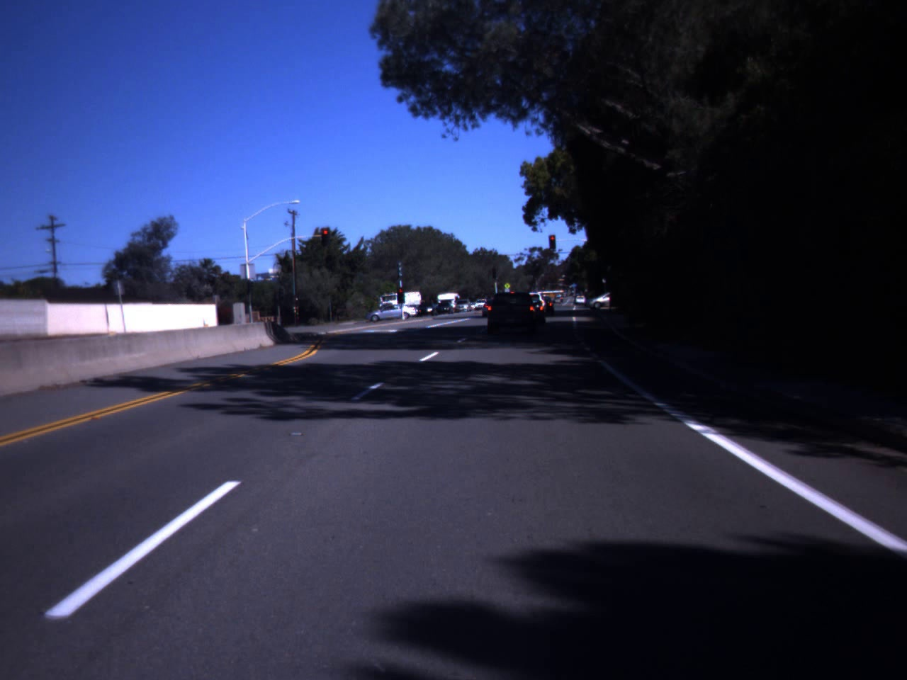
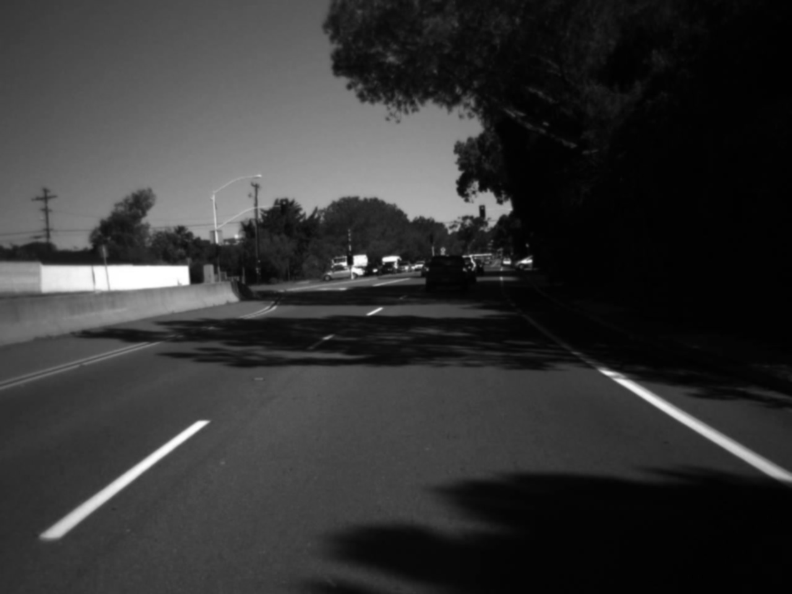
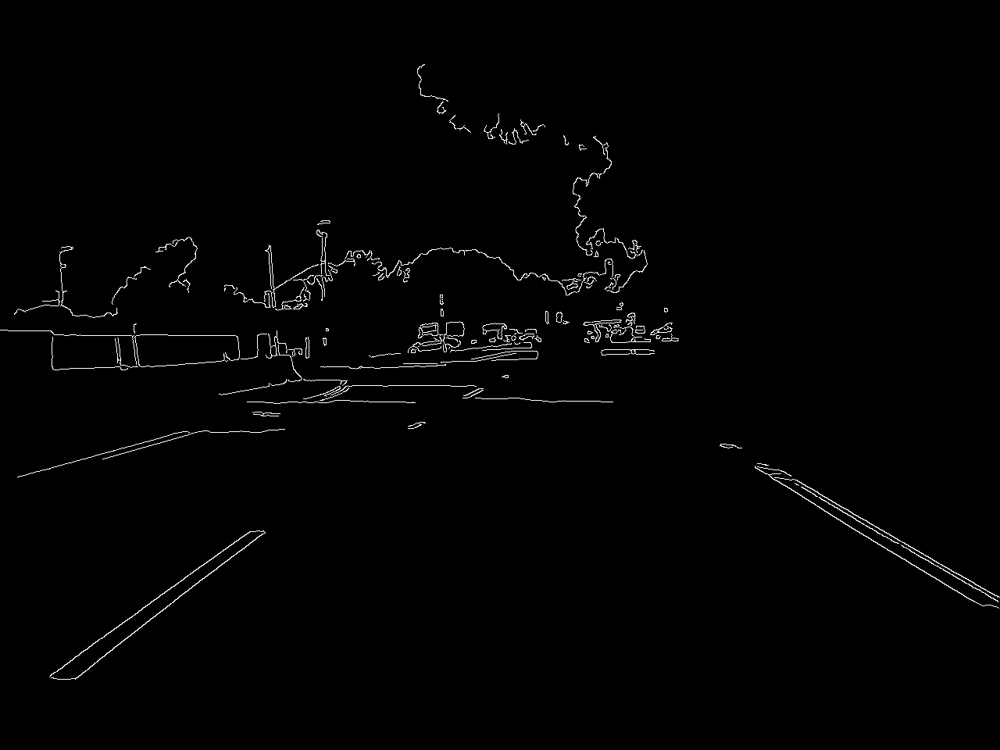
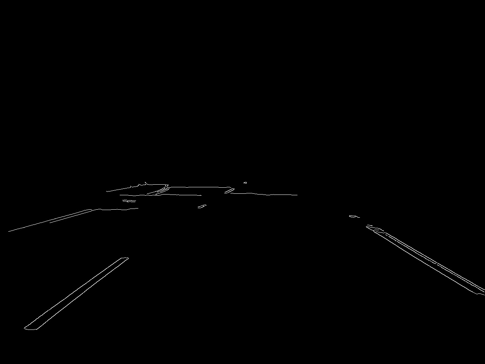
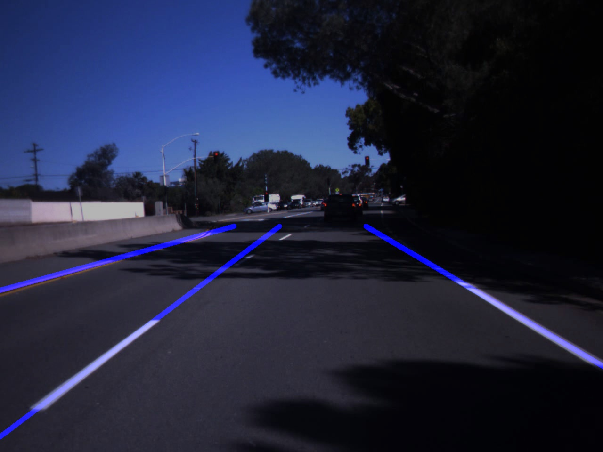

# LaneDetection
Using computer vision determine which lane cars are in

## Rationale
I first dealt with detecting the lanes, extracting equations for the lines they follow. I then used a car cascading classifier (object detection method) to find bounding boxes for the cars and determined which lane they were in. The exact steps are explained in more detail below, using this image as an example:

### Image Preprocessing
I first converted the image to grayscale. This makes the image easier to work with since it reduces it from 3 channels (R,G,B) to one (Intensity). 

I then performed noise reduction/smoothing on it using a gaussian filter. This leads to better results for the canny edge detection, since the random changes in intensity caused by noise will be smoothed off.

###  Finding the lane lines
First, perform **canny edge detection** on your preprocessed image. This basically looks at partial derivatives of the image in two directions to determine where there are changes in intensity. You set  thresholds on the canny edge detection which dictate how sharp the change must be for us to consider it an edge. Any difference above the high threshold is kept, anything below the low threshold is thrown out, and anything between the two thresholds that is connected to an edge is also kept. This is great for our application, since the intesnity difference between lane lines and the road are usually very sharp.

Next, I threw out the parts of the image that were irrelevant to us, leaving us with a **region of interest**, or **ROI**. I assumed that the bottom half of the image was what we cared about, since the top half is typically the sky/horizon, so I created a mask (bottom half of image is white) that filters out the top half of the image when applied.

| Mask | Result of Applying Mask |
| --- | --- |
| |  |

Then, I preformed a **hough transform** on the image. The hough transform looks at the edge points of the image space (x, y) in the parameter space (slope, y-intercept), where they are represented as lines. As we map more and more edge points, more lines will be plotted in the parameter space. By using an **accumulator**, which basically counts how many lines cross over specific regions of the parameter space, we can find the local maxima, which gives us line parameters. Here are all the lines overlayed on the image.
 \* Caveat: polar coordinates (rho, theta) must be used instead of cartesian coordinates (x,y) for the image space due to the possibility of (nearly) infinite slopes.

Lastly, we must do some post processing on the lines from the hough transform. Mainly, we must try to combine line segments that come from the same lane line. This is done by grouping lines with very similar slopes (upper bounded difference of slopes). We can then get the average slopes and intercepts from each group, which give us lane line parameters. I also extended these lines to fill the bottom half of the image.

### Finding and placing the cars
I used a **haar cascading classifier** to get bounding boxes for the cars in the image. I then looked at the middle point of the bottom line segment of the box, because this should be in the middle of a lane. Then, we can calculate the x values for all the lane lines at the y value from this point. Lastly, we just see which interval it falls into (left of the first lane line is lane 0, increasing by 1 each lane), and label it on our image.

## Challenges/Improvements
The lane detection method above seems to perform poorly with dotted lines, often missing them completely. There are also occasional false positives, where sharp edges are falsely classified as lane lines (shadows, medians). I think extra image preprocessing would help with this. Namely, I'd like to filter by yellow and white to try to only detect lane line edges, which would in turn allow me to lower the canny edge detection thresholds. 

The region of interest constant is also not full proof. It often must be modified from image to image, lest you want lane lines going into the horizon.

The grouping of the hough transform lines is also occasionally faulty, where different lane lines with similar slopes (two very far to the side) are averaged together, leading to an output lane line splitting the two actual lane lines.

The haar cascading classifier I used is also not very good. I ran out of time to try and train my own.
## Links
Lane Detection, Hough Transform:
- https://blog.paperspace.com/understanding-hough-transform-lane-detection/
